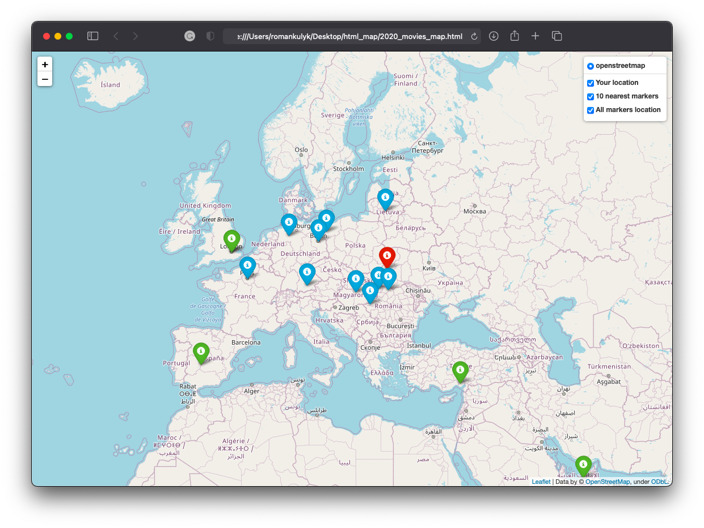

# HTML MAP

HTML MAP is a Python module that allows to build a map with markers of places where different films were captured during an exact year and shows 10 nearest locations to that one provided by the user.
The map is useful for visualizing the world and observing in which cities different films were made.

## Installation

Unfortunately, there is not an easy way to install this module. You should create a repository and then install it.

## Usage

Run main.py to start the application.
```zsh
>>> python main.py
Please enter a year you would like to have a map for: 
2020
Please enter your location (format: lat, long): 
49.83826, 24.02324                        
***** Please, keep in mind that the original database is too big, so it would take 14 days analyze it completely. ***** 
Choose how many lines of data would you like to proceed in range from 10 to 1241772: 
1000000
Your map is generating...
Please wait... 10% complete
Please wait... 20% complete
Please wait... 50% complete
Please wait... 70% complete
Please wait... 90% complete
Finished. Please have look at the map  2020_movies_map.html
```


## Contributing
Pull requests are welcome. For major changes, please open an issue first to discuss what you would like to change.

Please make sure to update tests as appropriate.

## License
[MIT](https://choosealicense.com/licenses/mit/)